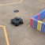

# warmup_project

## Drive in a square behaviour:

### High Level Description
The run method of my implementation carries out a single iteration of a loop that runs 4 times and instructs the robot to move forward 1m and turn left pi / 2 radians. At the end of this loop the robot has moved in a square and ends up back where it started. After the loop end, the robot is commanded to stop. My implmentation utilizes odometrey in order to coordinate the movements of the robot. 

### Code Explanation
I used two helper function
  - getDistance(a, b):
      - This function returns the distance between two (x, y) coords a and b. 
  - getDistance(a, b):
      - This function returns the radial distance between two radian coords a and b. 

The rest of my implementation is contained within the class DriveInSquare. It initializes the behavior's node, defines a publisher for the /cmd_vel topic, defines a subscriber for the /odom topic, sets the rate of the topic publishers, sets the speed of the robot, sets the side lenghts (1 m) and angles of the shape (pi / 2 rad) the robot should move around, initializes forward, turn, and stop commands for the robot to publish to /cmd_vel using the specified speeds, and initializes variables to hold the odometry state of the robot.
My DriveInSquare object implements the following functions:
  - setPose(msg):
      - this function is used as Callback to the Odometry subscriber
      - It sets the odometry state of the object, by taking and recording the x, y, and orientation coordinates of the robot
  - stop(duration):
      - this function publishes a stop command for 'duration' s
      - it does this in order to assure that the robot transitions to a stopped state
  - moveForward():
      - this method first records a start position using the current odometry (x,y) position state
      - it then proceeds to publih the forward command to the /cmd_vel topic until the robot has moved the specified length of the square, in  m
      - It checks this by continually comparing `getDistance(star position, current position)` to `distance`
      - once its done moving the robot the method calls stop(1)
  - turn():
      - this method first records a start rotation using the current odometry rotation state
      - it then proceeds to publih the turn command to the /cmd_vel topic until the robot has rotated the specified number of radians, in rad
      - It checks this by continually comparing `abs(start rotation, current rotation) ` to `radians`
      - once its done moving the robot the method calls stop(1)
  - singleLoop():
      - This function uses  moveForward and turn to move the robot in a square
      - it implements this behaviour by calling moveForward(), turn() four times

  - run():
      - This function sleeps until the odometry state of the object is initialized
      - it then runs singleLoop() once and then exits
      
### GIF

## Follow Person Behavior

### High Level Description
The run method loops over a single function called `followPerson()` which makes the robot converge on the closest point it observes over LIDAR.

### Code Explanation
My implementation is contained within the class PersonFollower. It initializes the behavior's node, defines a publisher for the /cmd_vel topic, defines a subscriber for the /scan topic, sets the rate of the topic publishers, sets the max angular and linear velocities of the robot, sets closest the robot should get to an object, and the minimum distance an object must be within in order to be converged on by the robot.
My PersonFollower object implements the following functions:
  - setScan(msg):
      - this function is used as Callback to the LaserScan subscriber
      - It sets the scan state of the object, by taking and recording the ranges of objects around the robot
  - shutDown(duration):
      - This function is called when rospy shutdown
      - it stops the robot
  - followPerson():
    - This function publishes a velocity command which causes the robot to converge on the closest point.
    - It does this by first seeing if the scan state contains any non zero values less than the robots set minimum activation distance
    - It then records the range and angle of the smallest observed range
    - If it finds an object, if the object is in front of the robot, it sets a linear velocity proportional to the range and bearing of the perceived closest point.
    - Based on whether the object it to the left or the right of the robot, it sets an appropriate angular velocity proportional to how far off from 0 degrees the object's bearing is.
    - it then published the movement and returns
  - run():
      - This function sleeps until the scan state of the object is initialized
      - it then runs followPerson() until rospy is shutdown, at which point shutDown() is called and the program exits.

***Follow Person***

### GIF

## Challenges
 - The first challenge I faced when handling the robot was imprecision. My first approach was to transition my implementation from velocity duration based, to odometry based. The extra measurement radically improved my robots accuracy, however it still suffered issues. I realized I could fix this by adjusting the rate to reflect the data resolution I needed in my implementation. I settled on a rate of 20 Hz.
 - The second challeneg I faced was coming up with good proportional controls for my outputs. I especially had to face this difficulty in the People and Wall follower behaviors.

## Future Work
 - In the future I would take the basic Odometry controls of my DriveInSquare class and implement a movement library to use in future projects. In order to do this I would parameterize the class and all its methods. This might come in handy for the final project.
 - The use of the closest point using the scan subscriber was simple, but surprisingly effective. I will certainly use this method when designing converging robots, if my project requires it.

## Takeaways
- When working with kinematics and asynchronous programming, its beneficial to implement checks on movements with odometry. Moving by speed and distance was often inaccurate.
- It's helpful to parameterize your methods as much as possible in the beginning, to make testing and experimentation easier later.
- I should think deeply about PID controls before I try testing. I wasted alot of time trying to see if my logic was wrong, and not taking a look at how my controls could improve the accuracy of the robot.
- 
